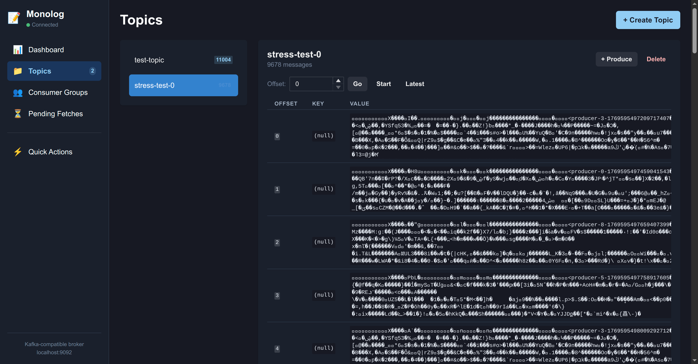

# Monolog

A lightweight, single-node message broker that speaks the Kafka protocol. Drop-in compatible with existing Kafka clients for development and testing scenarios.



## Features

- **Kafka Protocol Compatible** - Works with standard Kafka clients (tested with Sarama, kafka-go)
- **Dual Storage Backends** - SQLite (default, memory-efficient) or BadgerDB
- **Web UI** - Built-in dashboard for topic/message management
- **Consumer Groups** - Full support for consumer group coordination
- **Long Polling** - Efficient fetch with configurable wait times
- **Message Retention** - Configurable time-based message cleanup
- **Zero Dependencies** - Single binary, no external services required

## Quick Start

```bash
# Build
go build -o monolog ./cmd/monolog

# Run with defaults (SQLite, port 9092)
./monolog serve

# Or with options
./monolog serve --kafka-addr :9092 --http-addr :8080 --storage sqlite
```

Access:
- Kafka protocol: `localhost:9092`
- Web UI: `http://localhost:8080`

## Configuration

### Command Line Flags

```bash
./monolog serve \
  --config config.yaml \
  --kafka-addr :9092 \
  --http-addr :8080 \
  --data-dir ./data \
  --storage sqlite \
  --log-level info
```

### Environment Variables

```bash
MONOLOG_KAFKA_ADDR=:9092
MONOLOG_HTTP_ADDR=:8080
MONOLOG_DATA_DIR=./data
MONOLOG_STORAGE_BACKEND=sqlite
MONOLOG_LOG_LEVEL=debug
MONOLOG_AUTH_TOKEN=secret  # Enables HTTP auth
```

### Config File (YAML)

```yaml
server:
  kafka_addr: ":9092"
  http_addr: ":8080"

storage:
  backend: "sqlite"  # or "badger"
  data_dir: "./data"
  sync_writes: false

topics:
  auto_create: true

limits:
  max_connections: 100
  max_message_size: 1048576  # 1MB
  max_fetch_bytes: 10485760  # 10MB

retention:
  enabled: true
  max_age: 24h
  check_interval: 1m

groups:
  session_timeout: 30s
  heartbeat_interval: 3s

logging:
  level: "info"
  format: "text"
```

## Storage Backends

### SQLite (Recommended)
- Lower memory footprint (~23MB for 10k messages)
- Predictable performance
- WAL mode for concurrent reads

### BadgerDB
- Higher throughput for write-heavy workloads
- Higher memory usage (~150-200MB)
- Built-in compression

## Usage with Kafka Clients

### Go (Sarama)

```go
config := sarama.NewConfig()
config.Producer.Return.Successes = true
config.Consumer.Offsets.Initial = sarama.OffsetOldest

producer, _ := sarama.NewSyncProducer([]string{"localhost:9092"}, config)
producer.SendMessage(&sarama.ProducerMessage{
    Topic: "my-topic",
    Value: sarama.StringEncoder("hello"),
})
```

### Go (kafka-go)

```go
conn, _ := kafka.DialLeader(context.Background(), "tcp", "localhost:9092", "my-topic", 0)
conn.WriteMessages(kafka.Message{Value: []byte("hello")})
```

## HTTP API

| Endpoint | Method | Description |
|----------|--------|-------------|
| `/api/topics` | GET | List all topics |
| `/api/topics` | POST | Create topic |
| `/api/topics/{name}` | DELETE | Delete topic |
| `/api/topics/{name}/messages` | GET | Read messages |
| `/api/topics/{name}/messages` | POST | Produce message |
| `/api/groups` | GET | List consumer groups |
| `/api/groups/{id}` | GET | Get group details |
| `/api/groups/{id}` | DELETE | Delete group |
| `/api/pending` | GET | List pending fetches |
| `/api/stats` | GET | Server statistics |

## Supported Kafka APIs

| API | Key | Versions |
|-----|-----|----------|
| Produce | 0 | 0-7 |
| Fetch | 1 | 0-11 |
| ListOffsets | 2 | 0-5 |
| Metadata | 3 | 0-9 |
| OffsetCommit | 8 | 0-8 |
| OffsetFetch | 9 | 0-7 |
| FindCoordinator | 10 | 0-3 |
| JoinGroup | 11 | 0-7 |
| Heartbeat | 12 | 0-4 |
| LeaveGroup | 13 | 0-4 |
| SyncGroup | 14 | 0-5 |
| CreateTopics | 19 | 0-5 |
| ApiVersions | 18 | 0-3 |

## Limitations

- Single node only (no replication)
- Single partition per topic
- No authentication on Kafka protocol (HTTP supports token auth)
- No TLS on Kafka protocol yet

## Building

```bash
# Binary only
go build -o monolog ./cmd/monolog

# With web UI
cd web && npm install && npm run build && cd ..
go build -o monolog ./cmd/monolog
```

## License

MIT
